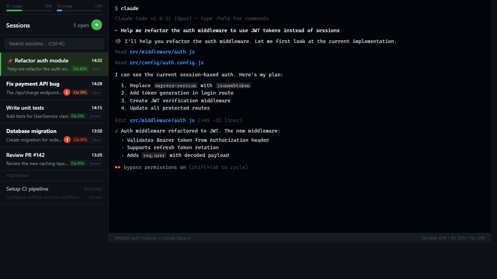
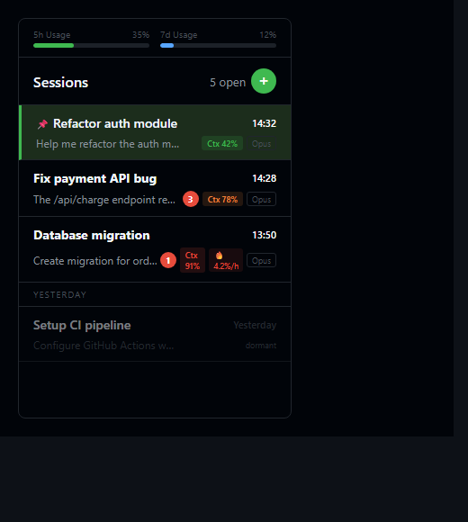
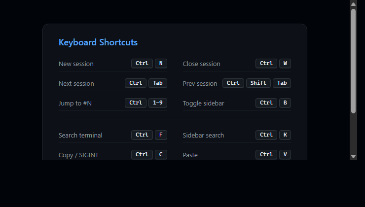

# Claude Session Hub

[English](#english) | **中文**

> 类微信风格的 Claude Code 多会话终端管理器，在一个窗口里管理所有 AI 编程会话。



## v0.1.1 更新

- 新增项目内 JSON 默认工作路径配置：`config/session-hub.json`
- 顶部工作路径支持直接点击编辑
- `PowerShell` session 修改路径后会立即切换目录
- 新增 `PowerShell (Admin)` 快捷入口，可直接弹出 UAC 启动管理员 PowerShell
- 右键菜单新增 `Rename session`
- 支持双击 session 标题内联重命名
- 重启 session 时保留原工作路径

## 功能特性

| 功能 | 说明 |
|------|------|
| **多会话管理** | 创建、切换、置顶、关闭多个 Claude Code 会话 |
| **休眠恢复** | 关闭 Hub 后会话不丢失，下次打开点击即可恢复 |
| **未读提醒** | AI 回复完成自动标记未读数，不错过任何回复 |
| **Context 监控** | 实时显示每个会话的上下文使用率（绿/橙/红） |
| **用量监控** | 侧栏顶部显示 5 小时 / 7 天用量进度条 |
| **终端搜索** | Ctrl+F 终端内搜索，支持高亮、上下导航 |
| **URL 点击** | 终端内链接 Ctrl+Click 直接打开浏览器 |
| **文件拖拽** | 拖拽文件/文件夹到终端自动插入路径 |
| **手机遥控** | PWA 远程控制，支持 Tailscale 局域网 |
| **快捷键全覆盖** | 几乎所有操作都有快捷键（见下表） |

## 前置条件

- **Windows 10/11**
- **Claude Code CLI** 已安装并登录（运行 `claude --version` 验证）
- **Clash 代理** 运行在 `127.0.0.1:7890`（或修改 `core/session-manager.js` 顶部的 `CLAUDE_PROXY` 常量）

## 快速安装

### 方式 A：下载安装包（推荐）

前往 [Releases](https://github.com/TianLin0509/claude-session-hub/releases) 下载最新 `.exe` 安装包，双击安装即可。无需 Node.js 或编译工具。

### 方式 B：从源码安装

```powershell
git clone https://github.com/TianLin0509/claude-session-hub.git
cd claude-session-hub
.\install.ps1
```

安装脚本会自动完成：
1. 检查 Node.js >= 18
2. 安装依赖（`npm install`，需要 C++ 编译工具编译 node-pty）
3. 部署 Hook 脚本到 `~/.claude/scripts/`
4. 配置 Claude Code 的 hooks（`~/.claude/settings.json`）
5. 创建桌面快捷方式

> **node-pty 编译失败？** 安装 [Visual Studio Build Tools](https://visualstudio.microsoft.com/visual-cpp-build-tools/)，勾选"使用 C++ 的桌面开发"工作负载。

## 首次使用

1. 双击桌面 **Claude Hub** 快捷方式
2. 按 **Ctrl+N** 新建 Claude 会话
3. 首次使用需在终端内输入 `/login` 登录你的 Claude 账号（登录一次后续自动生效）

`PowerShell (Admin)` 会打开一个独立的管理员 PowerShell 窗口，不会作为 Hub 内嵌 session 出现在侧栏中。

## 界面说明

### 侧栏



侧栏显示所有会话列表，每个会话包含：
- **会话标题** — 自动从对话内容提取
- **最后消息预览** — 显示最近一条用户输入
- **时间戳** — 最后活动时间
- **Context 徽章** — `Ctx XX%` 显示上下文使用率（绿 <70% / 橙 70-85% / 红 >85%）
- **未读计数** — 红色角标显示未读 AI 回复数
- **Burn Rate** — 高消耗会话显示 `🔥 X%/h` 估算每小时用量

侧栏顶部显示 5 小时和 7 天的用量进度条。休眠会话以半透明显示，点击即可恢复。

### 右键菜单

会话上右键可以：
- **Pin to top** — 置顶会话
- **Restart** — 重启会话（关闭当前 PTY，新建 Claude 实例）
- **Close** — 关闭会话

## 快捷键



| 快捷键 | 功能 |
|--------|------|
| Ctrl+N | 新建 Claude 会话 |
| Ctrl+W | 关闭当前会话 |
| Ctrl+Tab | 下一个会话 |
| Ctrl+Shift+Tab | 上一个会话 |
| Ctrl+1..9 | 跳转到第 N 个会话 |
| Ctrl+B | 折叠/展开侧栏 |
| Ctrl+F | 终端内搜索 |
| Ctrl+K | 聚焦侧栏搜索 |
| Ctrl+C | 复制选中文本（无选中时发送 SIGINT） |
| Ctrl+V | 粘贴（支持文本和图片） |
| Ctrl+= / Ctrl+- | 放大/缩小字号 |
| Ctrl+0 | 重置字号 |
| Ctrl+End / Ctrl+Home | 跳到底部/顶部 |
| Ctrl+滚轮 | 缩放字号 |

## 配置

### 代理

默认代理地址 `http://127.0.0.1:7890`（Clash）。如需修改，编辑 `core/session-manager.js` 顶部的 `CLAUDE_PROXY` 常量。

### Hook 脚本

安装到 `~/.claude/scripts/`：
- `session-hub-hook.py` — 通知 Hub AI 回复完成（驱动未读计数、消息预览）
- `claude-hub-statusline.js` — 推送 Context/Usage 数据到 Hub 侧栏

在 `~/.claude/settings.json` 的 `hooks` 和 `statusLine` 中注册。

## 卸载

1. 删除 `claude-session-hub` 文件夹（或通过控制面板卸载安装包版）
2. 删除 `~/.claude/settings.json` 中包含 `session-hub-hook` 的 hook 条目
3. 删除 `~/.claude/scripts/session-hub-hook.py` 和 `~/.claude/scripts/claude-hub-statusline.js`
4. 删除 `~/.claude-session-hub/`（运行时状态）

## 许可证

MIT

---

<a id="english"></a>

# Claude Session Hub

**English** | [中文](#claude-session-hub)

> WeChat-style multi-session terminal manager for Claude Code on Windows. Manage all your AI coding sessions in one window.


## v0.1.1 Update

- Added project-local JSON default working directory config: `config/session-hub.json`
- Working directory in the header is now directly editable
- `PowerShell` sessions switch directory immediately after cwd edit
- Added a `PowerShell (Admin)` shortcut that opens an elevated PowerShell via UAC
- Added `Rename session` to the context menu
- Added double-click inline session renaming for session titles
- Session restart now preserves the current working directory

## Features

| Feature | Description |
|---------|-------------|
| **Multi-session tabs** | Create, switch, pin, and close multiple Claude Code sessions |
| **Dormant restore** | Sessions survive app restart; click to resume |
| **Unread badges** | Auto-count unread AI replies per session |
| **Context monitoring** | Real-time context window % per session (green/orange/red) |
| **Usage tracking** | 5-hour and 7-day rate limit progress bars in sidebar |
| **Terminal search** | Ctrl+F in-terminal search with highlight and navigation |
| **URL click-to-open** | Ctrl+Click links in terminal to open in browser |
| **File drag-and-drop** | Drag files/folders into terminal to insert paths |
| **Mobile remote** | PWA remote control via Tailscale LAN |
| **Keyboard-first** | Full shortcut coverage (see table below) |

## Prerequisites

- **Windows 10/11**
- **Claude Code CLI** installed and logged in (`claude --version` to verify)
- **Clash proxy** running on `127.0.0.1:7890` (or edit `CLAUDE_PROXY` in `core/session-manager.js`)

## Quick Start

### Option A: Download Installer (recommended)

Go to [Releases](https://github.com/TianLin0509/claude-session-hub/releases), download the latest `.exe`, and run it. No Node.js or build tools needed.

### Option B: From Source

```powershell
git clone https://github.com/TianLin0509/claude-session-hub.git
cd claude-session-hub
.\install.ps1
```

The installer will:
1. Check Node.js >= 18
2. Run `npm install` (compiles native modules — needs C++ Build Tools)
3. Deploy hook scripts to `~/.claude/scripts/`
4. Configure Claude Code hooks in `~/.claude/settings.json`
5. Create a desktop shortcut

> **node-pty compilation fails?** Install [Visual Studio Build Tools](https://visualstudio.microsoft.com/visual-cpp-build-tools/) with "Desktop development with C++" workload.

## First Launch

1. Double-click the **Claude Hub** desktop shortcut
2. Press **Ctrl+N** to create your first Claude session
3. Type `/login` in the terminal to authenticate (one-time setup)

`PowerShell (Admin)` opens a separate elevated PowerShell window and does not appear as an in-app Hub session in the sidebar.

## Keyboard Shortcuts

| Shortcut | Action |
|----------|--------|
| Ctrl+N | New Claude session |
| Ctrl+W | Close current session |
| Ctrl+Tab / Ctrl+Shift+Tab | Next / Previous session |
| Ctrl+1..9 | Jump to session N |
| Ctrl+B | Toggle sidebar |
| Ctrl+F | Search in terminal |
| Ctrl+K | Focus sidebar search |
| Ctrl+C | Copy selection (SIGINT if no selection) |
| Ctrl+V | Paste (text or image) |
| Ctrl+= / Ctrl+- / Ctrl+0 | Zoom in / out / reset |
| Ctrl+End / Ctrl+Home | Scroll to bottom / top |

## Configuration

### Proxy

Default: `http://127.0.0.1:7890` (Clash). Edit `CLAUDE_PROXY` at the top of `core/session-manager.js` to change.

### Hook Scripts

Installed to `~/.claude/scripts/`:
- `session-hub-hook.py` — Notifies Hub when AI replies finish
- `claude-hub-statusline.js` — Sends context/usage data to sidebar

Registered in `~/.claude/settings.json` under `hooks` and `statusLine`.

## Uninstall

1. Delete the `claude-session-hub` folder (or uninstall via Control Panel)
2. Remove hook entries from `~/.claude/settings.json` (search for `session-hub-hook`)
3. Delete `~/.claude/scripts/session-hub-hook.py` and `~/.claude/scripts/claude-hub-statusline.js`
4. Delete `~/.claude-session-hub/` (runtime state)

## License

MIT
